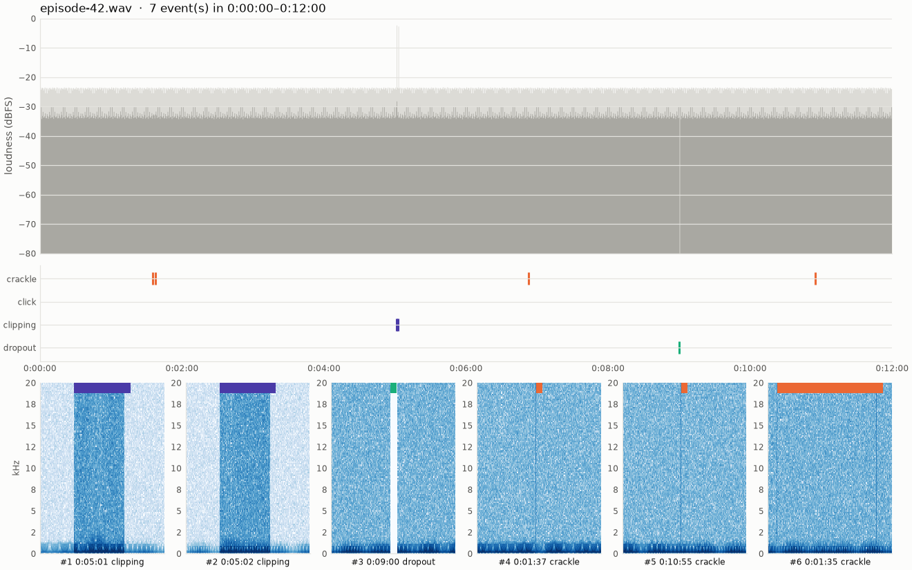

# crackle-finder

[](https://github.com/moudlajs/crackle-finder/actions/workflows/ci.yml)

Crackles, clicks, clipping and short dropouts are easy to hear and hard to find in a
two-hour podcast. `crackle-finder` scans long spoken-word recordings and gives you a
list of timestamps you can paste straight into a message to the creator, plus short
clips and a picture of where the problems are, so nobody has to listen to the whole
episode again.



## Install

Requires Python 3.11+ and [ffmpeg](https://ffmpeg.org/) on your `PATH`
(`brew install ffmpeg`, `sudo apt install ffmpeg`, ...).

```sh
uv tool install git+https://github.com/moudlajs/crackle-finder
```

URL input additionally needs [yt-dlp](https://github.com/yt-dlp/yt-dlp).

## Usage

```sh
crackle-finder episode.mp3                          # whole file
crackle-finder episode.mp3 --start 45:00 --end 1:05:30
crackle-finder episode.mp3 --z 4                    # more sensitive
crackle-finder episodes/                            # every audio file in the folder
crackle-finder https://example.com/episode-42       # any URL yt-dlp can fetch
crackle-finder episode.mp3 --fix                    # also write a repaired copy
```

| Option | Default | |
|---|---|---|
| `--start T`, `--end T` | whole file | analyze a section; `90`, `45:00` or `1:05:30`. Reported times stay relative to the original file |
| `--z Z` | `6` | sensitivity: lower finds more (and more false positives) |
| `--merge S` | `1.0` | detections closer than `S` seconds become one event |
| `--top N` | `50` | events in the stdout table and cut as clips |
| `--out DIR` | `./crackle-report` | one subfolder per input |
| `--fix` | off | write `fixed.flac` (see below) |
| `--no-clips`, `--no-plot` | | skip clips / `overview.png` |
| `--verbose` | | debug output, including the exact ffmpeg commands |

### What you get

```
crackle-report/episode-42/
├── timestamps.txt   # paste this into your message
├── labels.txt       # Audacity: File > Import > Labels, then jump between markers
├── events.json      # machine-readable events + run parameters
├── overview.png     # the picture above
├── clips/           # 3 s mp3 around each top event: 001_0h05m01s_clipping.mp3, ...
└── fixed.flac       # only with --fix
```

`timestamps.txt`, sorted by time:

```
0:01:35  crackle  (score 25)
0:01:37  crackle  (score 25)
0:05:01  clipping  (score 888)
0:05:02  clipping  (score 756)
0:06:52  crackle  (score 25)
0:09:00  dropout  (score 47)
0:10:55  crackle  (score 25)
```

and the top events on stdout, sorted by score:

```
episode-42: 7 event(s) -> crackle-report/episode-42/
7 event(s), showing top 7 by score
   #      time  length   score  type      frames
   1   0:05:01   0.45s     888  clipping       8
   2   0:05:02   0.45s     756  clipping       9
   3   0:09:00   0.05s      47  dropout        1
   4   0:01:37   0.05s      25  crackle        1
   5   0:10:55   0.05s      25  crackle        1
   6   0:01:35   0.85s      25  crackle        2
   7   0:06:52   0.75s      25  crackle        2
```

**Batch:** a directory analyzes every audio file in it and writes `summary.txt` with
the count per type per file, sorted by name (`ep2` before `ep10`), so you can see from
which episode a problem started. A file that fails is reported and skipped; the rest
still run.

**URLs** are downloaded once into `~/.cache/crackle-finder` (or `$XDG_CACHE_HOME`) and
reused on later runs; the report folder is named after the title.

**`--fix`** runs ffmpeg's `adeclick` and `adeclip` filters over the whole file and
writes `fixed.flac`. The original is never modified. It is slow (about a minute per
15 minutes of audio), reduces rather than perfectly repairs heavy clipping, and cannot
fix dropouts: that audio is simply missing.

## How detection works

The audio is decoded to mono at 44.1 kHz and cut into 50 ms frames. Each frame gets
four measurements:

- **crackle**: crest factor (peak / RMS) of the signal above 5 kHz. Crackles are
  sharp high-frequency spikes that speech rarely produces.
- **click**: the largest jump between neighbouring samples, relative to the frame's
  loudness.
- **clipping**: at least 3 samples above 98.5 % of full scale.
- **dropout**: a frame below -60 dBFS sandwiched between two frames above -35 dBFS.

Crackle and click values are turned into robust z-scores (median and MAD instead of
mean and standard deviation, so the defects themselves don't skew the baseline). A
frame is flagged when its score exceeds `--z`; clipping and dropouts are always
flagged. Flagged frames closer than `--merge` seconds are merged into one event,
labelled by its highest-scoring frame.

## Limitations

- **False positives**: sibilants ("s", "sh"), laughter, claps, and sharp percussion in
  intros can look like crackles. Check the clips; raise `--z` if there are too many.
- **Mono downmix**: a defect in only one channel is diluted when the channels are mixed.
- **Dropouts** are only caught when they are short (one silent frame, about 50-100 ms)
  and surrounded by speech. Longer gaps look like pauses.
- **Clipping scores** grow with the number of clipped samples, so heavy clipping
  outranks everything else in the top-N list.
- **Memory**: the whole file is analyzed at once, roughly 3 GB of RAM per hour of audio.
- Scores are relative to the recording itself, so they are not comparable between files.

## Roadmap

- Stream long files in chunks to cut memory use.
- Per-channel analysis for stereo recordings.
- Catch longer dropouts.
- Optional HTML report with playable clips.

## Development

See [CONTRIBUTING.md](CONTRIBUTING.md). `uv run python docs/make_example.py`
regenerates the image and sample output above from synthetic audio.

## License

[MIT](LICENSE)
